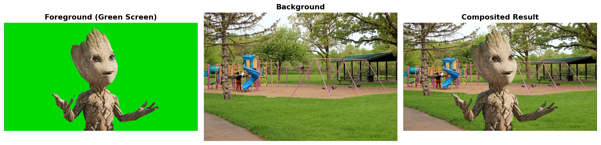
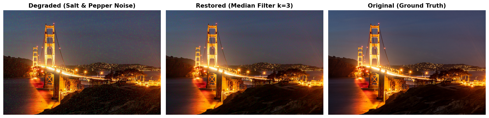
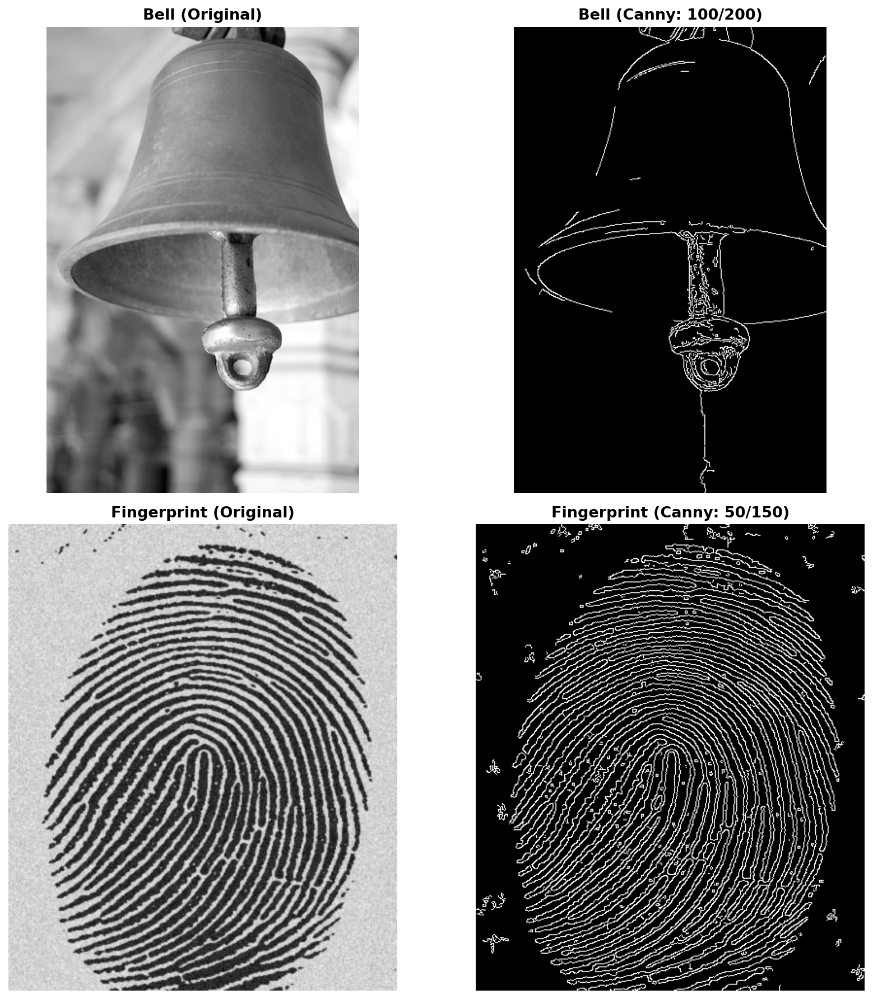

# Image Processing Fundamentals

Three core image processing techniques implemented from scratch using OpenCV and NumPy: green screen compositing, noise restoration, and edge detection.

**Course:** CSE612 — Computer Vision

---

## Task 1: Green Screen Compositing

Pixel-level chroma keying that identifies green-dominant pixels in a foreground image and replaces them with the corresponding background pixels.

<p align="center">
  
</p>

**How it works:** For each pixel, the algorithm checks if the green channel dominates both red and blue by a threshold margin (`G > 150` and `G > R + 50` and `G > B + 50`). Pixels meeting this condition are replaced with the resized background. This avoids misclassifying natural green tones (like skin shadows) as chroma key.

```python
def mergeImage(fg, bg):
    for y in range(height):
        for x in range(width):
            b, g, r = fg[y, x]
            if int(g) > 150 and int(g) > int(r) + 50 and int(g) > int(b) + 50:
                result[y, x] = bg_resized[y, x]
    return result
```

---

## Task 2: Image Restoration

Identifying and removing salt-and-pepper noise from a degraded image using a median filter.

<p align="center">
  
</p>

**Degradation type:** Salt-and-pepper noise — random pixels set to extreme values (bright green/colored specks visible in the sky region of the degraded image).

**Why median filter?** Unlike Gaussian blur which averages all neighbors (blurring edges), median filter replaces each pixel with the median of its neighborhood. This eliminates outlier noise pixels while preserving sharp edges. A small kernel (`k=3`) is sufficient for single-pixel noise.

```python
restored = cv2.medianBlur(degraded, 3)
```

---

## Task 3: Canny Edge Detection

Applying the Canny edge detector with tuned thresholds to extract meaningful edges from two different image types.

<p align="center">
  
</p>

| Image | Low Threshold | High Threshold | Rationale |
|-------|:------------:|:--------------:|-----------|
| Bell | 100 | 200 | Higher thresholds suppress background blur while capturing the bell's strong contours |
| Fingerprint | 50 | 150 | Lower thresholds needed to detect the fine ridge patterns without losing detail |

**Threshold selection:** The Canny algorithm uses hysteresis thresholding — edges above the high threshold are kept, edges below the low threshold are discarded, and edges in between are kept only if connected to strong edges. The 1:2 ratio between low and high thresholds is a common starting point recommended by Canny himself.

---

## Project Structure

```
Image_processing/
├── image_processing_fundamentals.ipynb   # Main notebook with all three tasks
├── outputs/
│   ├── task1_greenscreen.png
│   ├── task2_restoration.png
│   └── task3_canny.png
├── fg.jpg                  # Foreground (green screen)
├── bg.jpg                  # Background scene
├── Clear.jpg               # Clean reference image
├── Degraded.jpg            # Noisy image
├── bell.jpg                # Edge detection input
└── finger_print.jpg        # Edge detection input
```

---

## Setup

```bash
pip install opencv-python numpy matplotlib jupyter
jupyter notebook image_processing_fundamentals.ipynb
```

---

## Tech Stack


